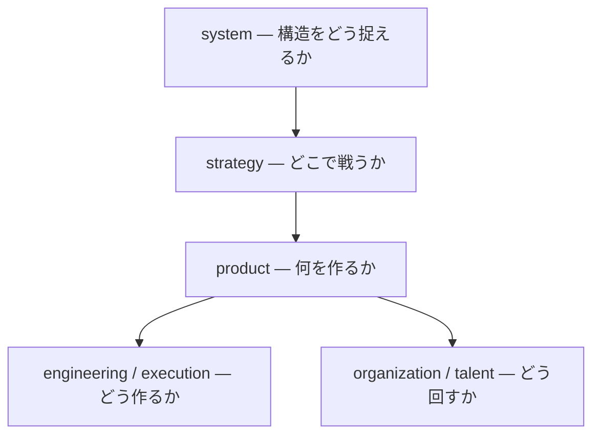
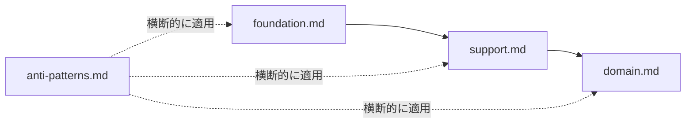

# Core — 思考原則

思考・意思決定の安定した原則を定義するレイヤー。
thinking-mode や output-mode はこの原則をベースとして重ねて適用される。

## 位置づけ

Mind as Code において、core は思考の土台である。
役割（thinking-mode）や表現（output-mode）が変わっても、ここに定義された原則は変わらない。

core は単に「正しく考える」ための原則ではなく、
不確実な状況下で「更新可能な状態を維持しながら前進する」ための思考基盤である。

そのために、意思決定は以下を満たすことを前提とする。

- 仮説として前進できること（停止しないこと）
- 観測によって検証・更新できること
- 可逆性を前提にリスクを制御できること

## 内部構造

core 内のファイルは以下の4層に分類される。上位の層は下位の層に依存しない。

```
Foundation — 基盤
  └─ Support — 思考支援
       └─ Domain — 適用領域

Constraint — 横断制約── 全層に対する禁止ルール
```

### Foundation — 基盤

全ての思考の起点となる原則。他の core ファイルはこの層を前提とする。

| ファイル | 含まれる原則 |
|---|---|
| [foundation.md](foundation.md) | 意思決定原則、意思決定の設計、優先順位ルール、衝突解決 |

### Support — 思考支援

基盤の原則を実行・深化させるための手段。

| ファイル | 含まれる原則 |
|---|---|
| [support.md](support.md) | 実行、不確実性、時間軸 |

### Domain — 適用領域

基盤と思考支援を特定の領域に適用した原則。

| ファイル | 含まれる原則 |
|---|---|
| [domain.md](domain.md) | 構造・システム観、戦略観、プロダクト・事業観、組織観、技術観、人材・成長観 |

### Constraint — 横断制約

全層に対する禁止ルール。基盤・思考支援・適用領域の裏返し。

| ファイル | 概要 |
|---|---|
| [anti-patterns.md](anti-patterns.md) | NGパターン — 全原則に対する禁止事項 |
| [echo-chamber-risk.md](echo-chamber-risk.md) | 自己強化ループのリスク — 思考OSが閉じることを防ぐ横断制約 |

## Annotation Tags

core の原則のうち、認知的に補正が必要なものには annotation を付与する。

| tag | meaning |
|---|---|
| [補正] | 素の傾向では逆方向に流れがちな場面で、意識的に押し戻す原則 |

annotation は原則の正しさや優先度を示すものではなく、
「素のままでは到達できない判断を、意識的に維持していること」を示すメタ情報である。

annotation は原則と同じ行に付与する。

```md
- 問題は構造として捉える
- 更新されない状態を最も警戒する
- [補正] 可逆なら仮決めして進める
- 確実性を求めすぎて停止する
```

annotation のない原則は、素または経験を通じて内在化されており、意識的な補正を必要としない。
annotation 自体も固定化せず、観測・更新対象として扱う。

## 思考の順序

Domain — 適用領域は以下の順序で上位が下位を規定する。上位の問いが定まらなければ、下位の判断はぶれる。



3つの軸で捉えると:
- **system** — 認識の軸（構造をどう捉えるか）
- **strategy** — 意思決定の軸（どこで戦うか）
- **product** — 価値の軸（何を作るか）

foundation・support は全階層を横断する意思決定の道具として機能する。

## 依存関係



## 更新プロトコル

core は最も安定した層だが、不変ではない。前提や判断が更新されない状態こそが、意思決定原則が最も避けるべきとする状態である。

core を更新する際は、以下のプロセスに従う。

1. **変更の動機を明確にする** — どの前提が変わったのか、なぜ現在の原則では不十分なのか
2. **影響範囲を確認する** — 変更が thinking-mode・output-mode・receiver-model・usecase に与える影響を洗い出す
3. **トレードオフを明示する** — 変更によって何を得て、何を失うか
4. **段階的に適用する** — 影響範囲が大きい場合は、小さく検証してから全体に展開する

また、原則自体の運用においても同様に扱う。

- 原則は固定的なルールではなく、仮説として扱う
- 実運用の中で検証し、必要に応じて更新する
- 更新されない原則は劣化するため、定期的に見直す

## 拡張ルール

思考原則を変更・追加する場合は、このレイヤーを更新する。
thinking-mode や output-mode に原則を混ぜないこと。

新しい原則を追加する際は、上記のどの層に属するかを明確にし、該当ファイルに追記する。
