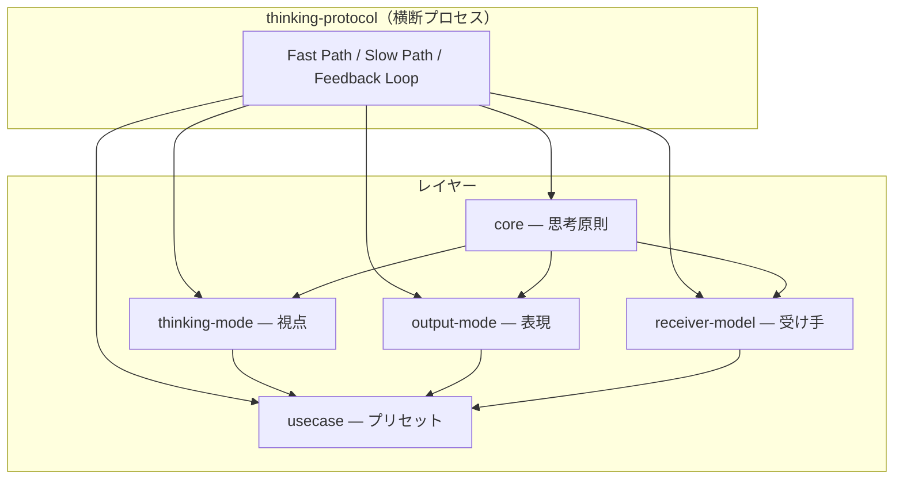
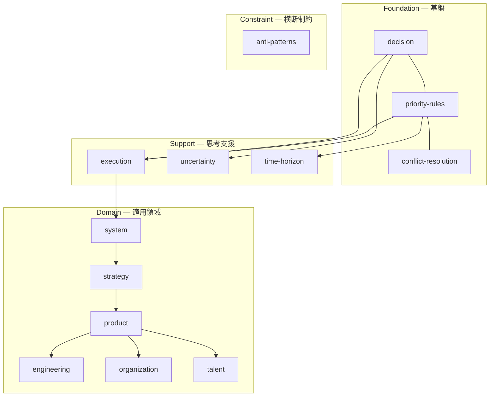
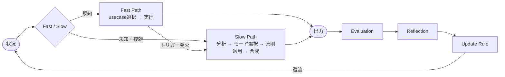

# Architecture

Mind as Code の全体構造、レイヤー間の関係、データフローを定義する。

## 全体構造



## レイヤー間の依存方向

依存は一方向のみ。逆方向・横方向の依存は禁止。

```
core ← thinking-mode
core ← output-mode
core ← receiver-model
thinking-mode + output-mode + receiver-model ← usecase
全レイヤー ← thinking-protocol（参照のみ、他から参照されない）
```

thinking-mode・output-mode・receiver-model は互いを参照しない。

## core 内部の構造



3つの軸:
- **system** — 認識の軸（構造をどう捉えるか）
- **strategy** — 意思決定の軸（どこで戦うか）
- **product** — 価値の軸（何を作るか）

## データフロー（思考プロセス）



思考中に横断的に使用するツール:
- inquiry-framework — 思考の精度を高める問い
- abstraction-level — 抽象・構造・具体の行き来
- composition-rule — 複数thinking-modeの合成
