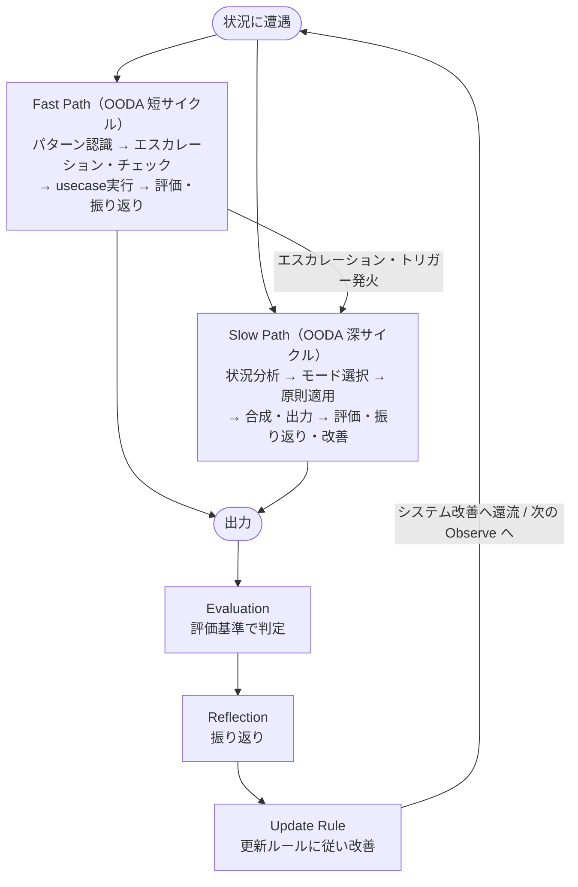

# Thinking Process — 思考プロセス

各レイヤーの内容（何を考えるか）ではなく、レイヤーをどう動かすか（思考のプロセス）を定義する。

## 設計思想

全ての意思決定に同じ負荷をかけない。Daniel Kahneman の System 1 / System 2 の知見に基づき、思考プロセスを2速で設計する。

- **Fast Path（System 1的）**: パターン認識による迅速な処理。既知のusecaseにマッチする場面で使用
- **Slow Path（System 2的）**: 意識的・分析的な処理。新規・複雑・高リスクな場面で使用
- **エスカレーション・トリガー**: Fast Path から Slow Path への切り替え条件

System 1 を否定するのではなく、訓練する。usecase は「信頼できる System 1」を構築するための教材である。ただし System 1 の限界を認識し、必要な時に System 2 を起動する仕組みを持つ。

また、Fast Path / Slow Path のいずれも、Observe → Orient → Decide → Act のループとして捉える。
Fast / Slow は思考速度と負荷の違いであり、OODA はその両方を貫く基本的な運転原理である。

## 基本ループ（OODA）

全ての思考プロセスは、以下の4段階のループとして扱う。

1. **Observe** — 状況・シグナル・制約を観測する
2. **Orient** — 観測結果を構造として解釈し、前提と文脈を整理する
3. **Decide** — 可逆性・影響範囲・原則に基づいて判断する
4. **Act** — 実行し、次の観測に返す

このループは一度で完了するものではなく、必要に応じて繰り返し回す。
Fast Path は短いループで、Slow Path は深いループである。

## プロセス全体像

全体像は Fast / Slow の2速パスと、出力後のフィードバックループを表す。各パスの内部では OODA が異なる深度で回る（Fast は短いサイクル、Slow は深いサイクル）。

---

## Fast Path

パターン認識による迅速な思考プロセス。既知の状況に対して、蓄積された判断パターン（usecase）を適用する。

Fast Path は OODA を短いサイクルで回すモードである。
Observe / Orient を最小限に圧縮し、既存のusecaseを使って Decide / Act へ素早く接続する。

### いつ使うか

- 状況が既知のusecaseにマッチする
- 過去に同種の判断を行った経験がある
- 時間的制約が強い

### Fast Path プロセス

#### 1. パターン認識

状況を認識し、既存のusecaseとの一致を判断する。

- この状況はどのusecaseに近いか？
- 過去に同じパターンで成功した経験があるか？

ここでは主に Observe と Orient を高速に行う。

#### 2. エスカレーション・チェック

usecaseを選択した時点で、エスカレーション・トリガーを一巡する。トリガーに該当しなければ、そのまま進む。該当すれば Slow Path に移行する。

このチェックは省略しない。Fast Path の速度を維持しつつ、System 1 の誤りを検知する最小限の安全装置である。

Orient の再点検に相当する。トリガーが発火した場合は Slow Path の深いループに切り替える判断を行う。

#### 3. usecase実行

選択したusecaseに従い、思考・出力を行う。

これは Fast Path における Decide / Act に相当する。

#### 4. 評価・振り返り

実行後、必要に応じて出力を評価（tools.md: 評価基準）し、プロセスを振り返る（tools.md: 振り返り）。改善すべき点があれば更新ルール（tools.md: システム更新のルール）に従いシステムに反映する。

全てのFast Pathで詳細な評価・振り返りは不要だが、「何か引っかかる」感覚があれば進む。

Fast Path における学習ループであり、次の Observe / Orient の精度を高めるための還流である。

### Fast Pathの信頼性を高めるには

Fast Path の精度は、usecaseの質と使用経験に依存する。

- usecaseを繰り返し使い、内面化する
- 振り返りで得た知見をusecaseに反映する
- 新しいパターンに遭遇したら、Slow Path を経てからusecaseに追加する

Fast Path は「考えなくてよい」ではなく、「十分に訓練された判断を素早く実行する」プロセスである。

---

## エスカレーション・トリガー

Fast Path から Slow Path への切り替え条件。System 1 の判断を信頼してよい場面と、System 2 を起動すべき場面を区別する。

Fast Path でusecaseを選択した時点で、以下のトリガーを一巡する。1つでも該当すれば、Slow Path に移行する。全てのトリガーを精査する必要はない。最も関連性の高いものに注意を向ければよい。

### 1. 不可逆性

判断の結果を取り消せない、または取り消しのコストが極めて高い。

- 組織変更、人事判断、大規模な技術選定、契約、公開発言
- 「やり直しがきかない」と感じたら、それだけでSlow Pathに値する

### 2. 直感と原則の不一致

直感的な判断と、core の原則が示す方向が噛み合わない。

- 「こうすべきだ」と強く感じるが、優先順位ルールと合わない
- 直感が正しい可能性もあるが、不一致の理由を意識的に検証する価値がある

### 3. パターンの表面的一致

状況が既知のパターンに似ているが、前提や文脈が異なる。

- 過去の成功体験をそのまま適用しようとしている
- 「前もこれでうまくいった」が、今回も成立するか検証していない
- 意思決定原則の「判断は時間軸で分解する」に照らし、過去と現在を混同していないか

### 4. 利害関係者の対立

複数のステークホルダーが異なる結論を支持している。

- 自分の直感がどちらか一方に寄っている場合、その寄りがバイアスでないか確認する
- 組織観の「部分最適ではなく全体最適」を意識的に適用する場面

### 5. 時間圧力

「早く決めなければ」という圧力を感じている。

- 時間圧力そのものがバイアス源。本当に今すぐ判断が必要か？
- ただし危機対応のように、速度が本質的に重要な場面もある。「急ぐべき状況」と「急がされている状況」を区別する

### 6. 強い感情的反応

提案や状況に対して、強い賛成・反対・不安・高揚を感じている。

- 感情は情報であり、無視すべきではない。ただし感情だけで判断すべきでもない
- 強い感情がある時こそ、「前提を疑う」問いを意識的に起動する

### 7. 未知の領域

経験のない種類の判断に直面している。

- 既存のusecaseに近いものがない
- 類似パターンを無理に当てはめるより、Slow Path で状況を分析する方が安全

### 8. 自己強化ループの兆候

判断が自分の既存原理・過去判断・好む構造に都合よくフィットしすぎている。
主観判定にはバイアスがかかるため、以下の観測可能なシグナルで補う。

- 直近の重要判断で、本質的な反論を受けた回数が 0
- AI との対話で、反論なしの応答が連続している
- 過去半年で、core / thinking-mode の前提更新が 0
- 何が起きたら判断を更新するかが定義されていない

これらが複数該当する場合、Slow Path に移行し、tools.md のエコーチェンバー・チェック・反証・非反証領域を使う。

---

## Slow Path

意識的・分析的な思考プロセス。エスカレーション・トリガーが発火した場面、または既知のusecaseにマッチしない新規の状況で使用する。

Slow Path は OODA を深く回すモードである。
Observe / Orient に十分な負荷をかけ、必要に応じて Decide の前に前提や構造自体を見直す。

### Phase 1: 状況分析

問い返しフレーム（tools.md）の問いを使い、状況の構造を把握する。

このPhaseは主に Observe / Orient に対応する。

- **何の問題か？** — 目的を明確にする（「目的を明確にする」）
- **前提は何か？** — 暗黙の前提を洗い出す（「前提を疑う」）
- **構造はどうなっているか？** — 問題を分解する（「構造に落とす」）
- **時間軸は？** — 短期と長期で何が変わるか（「時間軸で捉える」）

全ての問いを使う必要はない。状況に最も効く問いを選択する。

#### 自己レビュー時の追加注意

対象が「自分の起案・自分の思考・自分の価値観」など自己である場合、Observe / Orient に固有のバイアスがかかる。以下を意識的に起動する。

- **既に書いた構成への固着を疑う** — 「ここまで書いた以上、この構造で進めたい」という慣性が働く。再フレーミングや構造変更の選択肢を意図的に並べる
- **手放したくないロジックを特定する** — 自分が気に入っている表現・論理・順序が、目的適合性ではなく愛着で残っていないかを問う
- **想定読者を自分以外に固定する** — 自己レビューでは無意識に「自分の現在の文脈」を補完しながら読んでしまう。読み手を具体的に1人想像し、その人の前提知識だけで読めるかを確認する
- **反論の手加減を疑う** — 他者にレビューする時より反論が甘くなる傾向がある。「他者の起案だったらこの粒度で指摘するか？」を自問する
- **自分の解像度を区別する** — 自分の中の「事実として確認済み」と「自分がそう思っているだけ」を明示的に切り分ける。自己レビューでは両者が混ざりやすい

これらは Phase 1 の問い返しフレームを置き換えるものではなく、自己が対象の時に追加で起動する観察軸である。

### Phase 2: モード選択

状況の性質に基づき、thinking-mode・output-mode・receiver-model を選択する。

**thinking-mode の選択基準:**

| 状況の性質 | 適用するモード |
|---|---|
| 投資判断・組織的意思決定 | executive |
| 設計・技術的判断 | tech-review |
| メンバーの成長・対話 | one-on-one |
| 機能・サービスの方向性 | product |

複数のモードが該当する場合は、モードの合成ルール（tools.md）に従い、主モードと補助モードを選択・合成する。

**output-mode の選択基準:**
チャネル（口頭・文書・ブログ・プレゼンテーション等）に応じて選択する。

**receiver-model の選択基準:**
受け手の現在の状態（探索的・懐疑的・不安・多忙 等）に応じて選択する。不明な場合は省略し、途中で判明した時点で調整する。

このPhaseは主に Orient の最終段（視点確定）に対応する。観測した構造に対して、どのレンズで判断・出力するかを選ぶ。

### Phase 3: 原則適用

選択したモードの追加ルールと、core の原則を重ねて思考する。

このPhaseは主に Decide に対応する。

- モードの追加ルール → 具体的な行動指針として適用
- core の原則 → 判断に迷った時の最終基準として参照
- anti-patterns.md → 「やってはいけないこと」の最終チェック
- echo-chamber-risk.md → 自己強化ループ、反証可能性、非反証領域の扱いを確認

重要な判断では、tools.md の以下を必要に応じて起動する。

- エコーチェンバー・チェック
- 反証
- 非反証領域

モードの指針と core の原則が対立する場合、core を優先する。core はモードよりも上位の層であり、モードは core の原則の範囲内で視点を追加するものである。

### Phase 4: 合成・出力

思考結果を output-mode × receiver-model に基づいて形にする。

このPhaseは主に Act に対応する。

- output-mode の構成パターンに従い、内容を組み立てる
- receiver-model の調整ルールに従い、伝え方を調整する

**core 原則の適用チェック:**

出力に core の原則が反映されているかを確認する。全てを適用する必要はなく、関連する原則のみチェックする。

- 個別の事象ではなく、構造・関係性として問題を捉えているか（core/domain.md: 構造・システム観）
- どの前提を疑い、どの前提に基づいて進むかを明示しているか（core/foundation.md: 意思決定原則）
- 不確実な前提に確信度が伴っているか（core/support.md: 不確実性）
- 短期と長期の判断を分離し、トレードオフを明示しているか（core/support.md: 時間軸）
- 仕組みとしてどう実現するかを示しているか（core/support.md: 実行）
- 組織の問題を個人ではなく、構造・プロセスの課題として扱っているか（core/domain.md: 組織観）
- 導入だけでなく、運用・継続性まで言及しているか（core/domain.md: 技術観）
- 個人スキルだけでなく、役割と期待値に言及しているか（core/domain.md: 人材・成長観）
- 顧客価値を起点に、再現可能でスケールする構造になっているか（core/domain.md: プロダクト・事業観）

### Phase 5: 評価・振り返り・改善

出力後、以下の順序でフィードバックループを回す。Slow Path を経た判断は、このループの価値が高い。

1. **評価** — 評価基準（tools.md: 目的適合性・構造の健全性・実行可能性・再現性）で出力を判定する
2. **振り返り** — 振り返り（tools.md）に従い、プロセス・パターン・原則を振り返る
3. **改善** — 更新ルール（tools.md）に従い、気づきをシステム更新に反映する

このPhaseは次の Observe / Orient の質を高めるための学習ループである。
